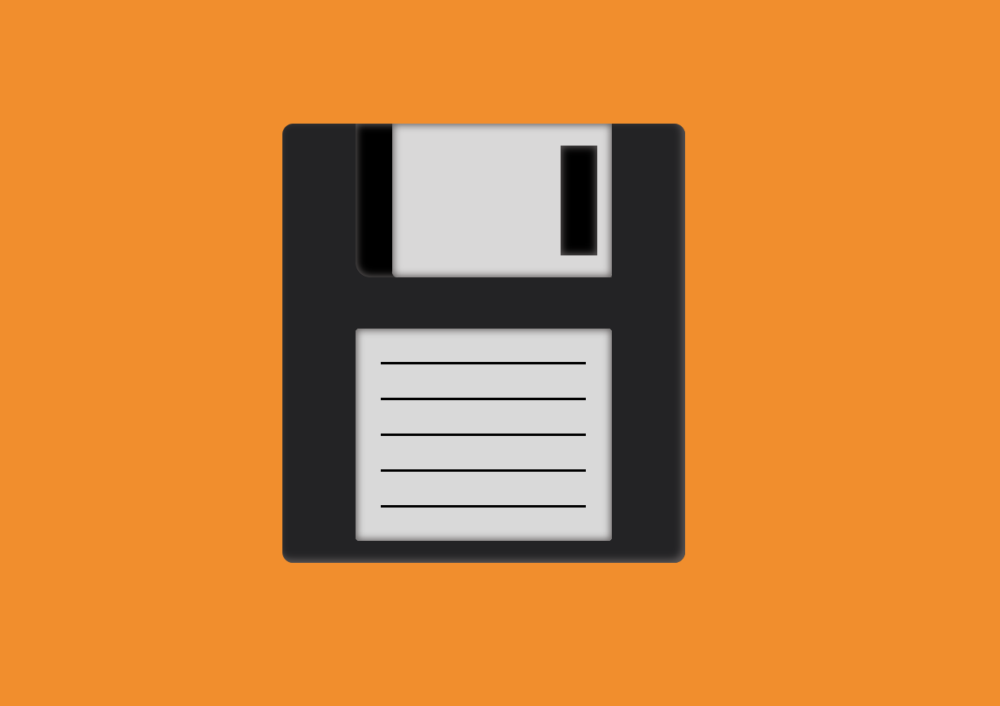
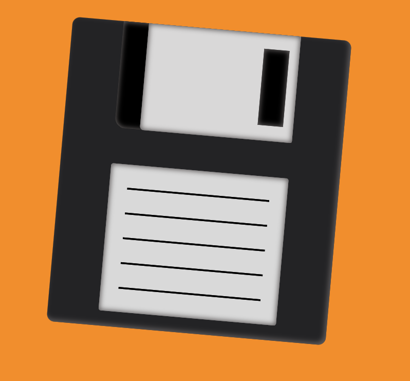

# Diskette

Este es un ejemplo que hemos hecho en el bootcamp de desarrollo FullStack con EOI. Se trata de un dibujo de un [diskette](https://es.wikipedia.org/wiki/Disquete) de los antiguos que hemos hecho con HTML y CSS probando el script de [mkweb](https://manz.dev/software/mkweb/) desarrollado por [Manz](https://manz.dev/).

## Foto del proyecto

Además tiene una pequeña transición que al pasar el ratón por encima del disco rota y se hace más grande.

